# Attack Tree Visualization - Golf Score Tracker & Handicap System

**Document Version:** 1.0
**Date:** November 12, 2025
**Assignment:** Assignment 2, Question 3 - Attack Tree Visualization
**Course:** CSE763 Secure Software Development

---

## AI Usage Log

### Interaction Summary

**Date:** November 12, 2025
**AI Assistant:** Claude Code (Sonnet 4.5)
**Task:** Attack Tree Visualization using Graphviz

**User Request:**
> "Please log our interaction to 'Attack-Tree-Visualization.md' in the ai-usage-logs/Question3 directory. Let's use Graphviz to visualize the attack trees we created in Attack-Tree-Creation.md."

**AI Response Process:**

1. **Reviewed attack tree structure** - Analyzed the 7 detailed attack trees from Attack-Tree-Creation.md
2. **Selected visualization approach** - Chose Graphviz DOT language for hierarchical graph rendering
3. **Designed visual schema** - Created color-coded system for:
   - Node types (root, intermediate, leaf)
   - Risk levels (feasibility, complexity, detection risk)
   - Logic gates (AND/OR operations)
   - Attack paths (primary vs. alternative)
4. **Created DOT specifications** - Developed complete Graphviz code for each attack tree
5. **Optimized for clarity** - Balanced detail vs. readability for complex trees
6. **Provided rendering instructions** - Added commands for generating PNG/SVG images
7. **Interactive elements** - Included legend and risk assessment visual indicators

**Key AI Capabilities Utilized:**
- Graphviz DOT language syntax generation
- Visual design for hierarchical attack path representation
- Color theory for risk-level differentiation
- Information architecture for complex tree structures
- Technical documentation for visualization workflows

**Output Generated:**
- 7 complete Graphviz DOT specifications
- Rendering instructions and commands
- Color-coded legend system
- Interactive risk assessment overlays
- Export formats (PNG, SVG, PDF)

**Tools Referenced:**
- Graphviz (graph visualization software)
- DOT language (declarative graph description)
- Command-line rendering utilities

---

## Introduction to Attack Tree Visualization

Attack trees are hierarchical diagrams that represent attack scenarios through a tree structure. Visualization helps security analysts:

1. **Understand Attack Paths** - See all possible routes to compromise
2. **Identify Bottlenecks** - Find critical nodes that block multiple attacks
3. **Prioritize Defenses** - Focus on high-risk paths
4. **Communicate Threats** - Share visual representations with stakeholders
5. **Quantify Risk** - Assess cumulative risk across paths

### Graphviz Overview

**Graphviz** is an open-source graph visualization software that uses the DOT language to describe graphs. Benefits:

- Declarative syntax (describe structure, not layout)
- Automatic layout algorithms
- Multiple output formats (PNG, SVG, PDF)
- Hierarchical tree support
- Rich styling options

### Installation

```bash
# macOS
brew install graphviz

# Ubuntu/Debian
sudo apt-get install graphviz

# Windows (with Chocolatey)
choco install graphviz

# Verify installation
dot -V
```

### Rendering Attack Trees

```bash
# Generate PNG image
dot -Tpng attack_tree.dot -o attack_tree.png

# Generate SVG (scalable, interactive)
dot -Tsvg attack_tree.dot -o attack_tree.svg

# Generate PDF
dot -Tpdf attack_tree.dot -o attack_tree.pdf

# High-resolution PNG
dot -Tpng -Gdpi=300 attack_tree.dot -o attack_tree_hires.png
```

---

## Visual Design Schema

### Color Coding System

**Node Types:**
- **Root Nodes** - Red (#FF6B6B) - Ultimate attack goal
- **AND Gates** - Orange (#FFA500) - All children required
- **OR Gates** - Yellow (#FFD93D) - Any child path succeeds
- **Leaf Nodes** - Light Green (#90EE90) - Specific actions/exploits

**Risk Levels (Border Colors):**
- **Feasibility:**
  - HIGH - Thick red border
  - MEDIUM - Orange border
  - LOW - Green border

- **Complexity:**
  - LOW - Single border
  - MEDIUM - Double border
  - HIGH - Triple border

- **Detection Risk:**
  - IMMEDIATE/HIGH - Dashed border
  - MEDIUM - Dotted border
  - LOW - Solid border

**Cost Indicators:**
- FREE - Normal font
- LOW - Italic font
- MEDIUM/HIGH - Bold font

### Node Label Format

```
[Node Name]
---
Feasibility: X
Complexity: Y
Cost: Z
Detection: W
```

---

## Attack Tree 1: Administrative Account Compromise

### Graphviz DOT Code


### Rendering Instructions

```bash
# Save the DOT code above to a file
cat > admin_compromise.dot << 'EOF'
[paste DOT code here]
EOF

# Generate high-quality PNG
dot -Tpng -Gdpi=300 admin_compromise.dot -o admin_compromise.png

# Generate interactive SVG
dot -Tsvg admin_compromise.dot -o admin_compromise.svg

# Generate PDF for printing
dot -Tpdf admin_compromise.dot -o admin_compromise.pdf
```

### Visual Output Description

The rendered attack tree will show:
- **Red root node** at the top representing the ultimate goal
- **Yellow OR diamond** showing three alternative attack paths
- **Orange AND diamonds** showing required conditions for each path
- **Green leaf nodes** at the bottom with specific attack actions
- **Dashed edges** connecting successful paths to post-compromise actions
- **Legend** in bottom corner explaining node types

---

## Attack Tree 2: Handicap Inflation (Score Manipulation)

### Graphviz DOT Code


### Key Visualization Features

This tree highlights:
- **Path 1 (Direct Manipulation)** - Most detailed, shows Burp Suite workflow
- **Critical Vulnerability Annotation** - Note box showing Assignment 3 priority
- **Risk Differentiation** - Path 3 nodes have dashed borders (HIGH detection)
- **Success Outcome** - Final node in red showing tournament win
- **Tool References** - Specific tools (Burp Suite) and code locations

---

## Attack Tree 3: Mass Data Extraction via IDOR (Simplified)

### Graphviz DOT Code


---

## Attack Tree 4: Insider Fraud Operation (High-Level)

### Graphviz DOT Code


### Unique Features

This tree emphasizes:
- **Dark red root** (CRITICAL impact)
- **AND gate at top level** - All components required for fraud operation
- **Financial outcomes** - Shows revenue model
- **Audit log manipulation** - Highlighted with dashed borders
- **Risk annotation** - Emphasizes lack of controls

---

## Attack Tree 5: Website Defacement/DoS (Simplified)

### Graphviz DOT Code


---

## Combined Risk Heatmap Visualization

### Graphviz DOT Code

This visualization shows all attack trees in a single risk matrix:

```dot
digraph RiskHeatmap {
    rankdir=LR;
    node [shape=box, style="rounded,filled", fontname="Arial"];

    // Title
    title [label="Attack Tree Risk Heatmap\nGolf Score Tracker",
           shape=plaintext, fontsize=16, fontcolor="#000000"];

    // Risk matrix quadrants
    subgraph cluster_matrix {
        label = "Risk Matrix: Likelihood × Impact";
        style = filled;
        fillcolor = "#F5F5F5";
        fontsize = 12;

        // High Likelihood, High Impact (CRITICAL)
        quad_hh [label="HIGH LIKELIHOOD\nHIGH IMPACT\n━━━━━━━━━━━━━\nTree 2: Handicap Inflation\nTree 3: IDOR Data Extraction\nTree 6: Competitive Intel",
                 fillcolor="#FF6B6B", fontcolor=white, fontsize=10, penwidth=3];

        // Medium Likelihood, Critical Impact (HIGH)
        quad_mc [label="MEDIUM LIKELIHOOD\nCRITICAL IMPACT\n━━━━━━━━━━━━━\nTree 1: Admin Compromise\nTree 4: Insider Fraud\nTree 7: SQL Injection Dump",
                 fillcolor="#FFA500", fontcolor=white, fontsize=10, penwidth=2];

        // Medium Likelihood, Medium Impact (MEDIUM)
        quad_mm [label="MEDIUM LIKELIHOOD\nMEDIUM-HIGH IMPACT\n━━━━━━━━━━━━━\nTree 5: Defacement/DoS",
                 fillcolor="#FFD93D", fontcolor=black, fontsize=10, penwidth=2];

        // Low Likelihood, High Impact (MONITOR)
        quad_lh [label="LOW LIKELIHOOD\nHIGH IMPACT\n━━━━━━━━━━━━━\n(No trees in this category)",
                 fillcolor="#90EE90", fontcolor=black, fontsize=10, penwidth=1];

        quad_hh -> quad_mc [style=invis];
        quad_mc -> quad_mm [style=invis];
        quad_mm -> quad_lh [style=invis];
    }

    // Common vulnerabilities
    subgraph cluster_vulns {
        label = "Common Critical Vulnerabilities";
        style = filled;
        fillcolor = "#FFEEEE";
        fontsize = 12;

        vuln1 [label="No Score Verification\n(HMAC/Signatures)", fillcolor="#FF6B6B", fontcolor=white, style="rounded,filled"];
        vuln2 [label="IDOR at /api/handicap", fillcolor="#FF6B6B", fontcolor=white, style="rounded,filled"];
        vuln3 [label="Weak Password Hashing\n(SHA256)", fillcolor="#FFA500", fontcolor=white, style="rounded,filled"];
        vuln4 [label="No Rate Limiting", fillcolor="#FFA500", fontcolor=white, style="rounded,filled"];
        vuln5 [label="SQL Injection", fillcolor="#FFA500", fontcolor=white, style="rounded,filled"];

        vuln1 -> vuln2 [style=invis];
        vuln2 -> vuln3 [style=invis];
        vuln3 -> vuln4 [style=invis];
        vuln4 -> vuln5 [style=invis];
    }

    // Assignment mitigation
    subgraph cluster_assign {
        label = "Mitigation Assignments";
        style = filled;
        fillcolor = "#E8F4F8";
        fontsize = 12;

        assign3 [label="Assignment 3:\nCryptographic APIs\n━━━━━━━━━━━━━\n• Bcrypt password hashing\n• HMAC score signatures\n• PII encryption",
                 fillcolor="#4A90E2", fontcolor=white, style="rounded,filled"];

        assign4 [label="Assignment 4:\nDAST & Vulnerability Fixes\n━━━━━━━━━━━━━\n• Fix IDOR (authorization)\n• Rate limiting\n• CSRF tokens\n• SQL injection fixes\n• Session regeneration",
                 fillcolor="#50C878", fontcolor=white, style="rounded,filled"];

        assign3 -> assign4 [style=invis];
    }

    title -> quad_hh [style=invis];
}
```



### Rendering Instructions

```bash
# Render risk heatmap
dot -Tpng -Gdpi=300 risk_heatmap.dot -o risk_heatmap.png
dot -Tsvg risk_heatmap.dot -o risk_heatmap.svg
```

---

## Batch Rendering Script

Create a script to render all attack trees at once:

### `render_all_trees.sh`

```bash
#!/bin/bash

# Create output directory
mkdir -p attack_tree_visualizations

# Array of DOT files
trees=(
    "admin_compromise"
    "handicap_inflation"
    "idor_data_extraction"
    "insider_fraud"
    "defacement_dos"
    "risk_heatmap"
)

# Render each tree in multiple formats
for tree in "${trees[@]}"; do
    echo "Rendering $tree..."

    # PNG (high resolution)
    dot -Tpng -Gdpi=300 "${tree}.dot" -o "attack_tree_visualizations/${tree}.png"

    # SVG (interactive, scalable)
    dot -Tsvg "${tree}.dot" -o "attack_tree_visualizations/${tree}.svg"

    # PDF (for printing)
    dot -Tpdf "${tree}.dot" -o "attack_tree_visualizations/${tree}.pdf"

    echo "✓ ${tree} rendered successfully"
done

echo ""
echo "All attack trees rendered to attack_tree_visualizations/"
echo "Formats: PNG (300 DPI), SVG, PDF"
```

### Usage

```bash
# Make executable
chmod +x render_all_trees.sh

# Run
./render_all_trees.sh
```

---

## Interactive HTML Viewer

### `attack_tree_viewer.html`

Create an HTML file to view all SVG visualizations interactively:

```html
<!DOCTYPE html>
<html lang="en">
<head>
    <meta charset="UTF-8">
    <meta name="viewport" content="width=device-width, initial-scale=1.0">
    <title>Attack Tree Visualization - Golf Score Tracker</title>
    <style>
        * {
            margin: 0;
            padding: 0;
            box-sizing: border-box;
        }

        body {
            font-family: 'Segoe UI', Tahoma, Geneva, Verdana, sans-serif;
            background: linear-gradient(135deg, #667eea 0%, #764ba2 100%);
            padding: 20px;
        }

        .container {
            max-width: 1400px;
            margin: 0 auto;
            background: white;
            border-radius: 10px;
            box-shadow: 0 10px 40px rgba(0,0,0,0.3);
            overflow: hidden;
        }

        header {
            background: linear-gradient(135deg, #FF6B6B 0%, #FFA500 100%);
            color: white;
            padding: 30px;
            text-align: center;
        }

        header h1 {
            font-size: 2.5em;
            margin-bottom: 10px;
        }

        header p {
            font-size: 1.2em;
            opacity: 0.9;
        }

        .tabs {
            display: flex;
            background: #f5f5f5;
            border-bottom: 2px solid #ddd;
            overflow-x: auto;
        }

        .tab {
            padding: 15px 25px;
            cursor: pointer;
            background: #f5f5f5;
            border: none;
            font-size: 14px;
            font-weight: 600;
            color: #555;
            transition: all 0.3s;
            white-space: nowrap;
        }

        .tab:hover {
            background: #e0e0e0;
        }

        .tab.active {
            background: white;
            color: #FF6B6B;
            border-bottom: 3px solid #FF6B6B;
        }

        .content {
            padding: 30px;
        }

        .tree-view {
            display: none;
        }

        .tree-view.active {
            display: block;
        }

        .tree-info {
            background: #f9f9f9;
            padding: 20px;
            border-radius: 8px;
            margin-bottom: 20px;
            border-left: 5px solid #FF6B6B;
        }

        .tree-info h2 {
            color: #FF6B6B;
            margin-bottom: 10px;
        }

        .tree-info .meta {
            display: grid;
            grid-template-columns: repeat(auto-fit, minmax(200px, 1fr));
            gap: 15px;
            margin-top: 15px;
        }

        .meta-item {
            background: white;
            padding: 10px 15px;
            border-radius: 5px;
            border-left: 3px solid #FFA500;
        }

        .meta-item strong {
            color: #555;
            display: block;
            margin-bottom: 5px;
            font-size: 12px;
            text-transform: uppercase;
        }

        .meta-item span {
            color: #333;
            font-size: 16px;
            font-weight: 600;
        }

        .svg-container {
            background: white;
            border: 1px solid #ddd;
            border-radius: 8px;
            padding: 20px;
            overflow: auto;
            max-height: 800px;
        }

        .svg-container svg {
            max-width: 100%;
            height: auto;
        }

        .legend {
            background: #f0f8ff;
            padding: 15px;
            border-radius: 8px;
            margin-top: 20px;
            border: 2px solid #4A90E2;
        }

        .legend h3 {
            color: #4A90E2;
            margin-bottom: 10px;
        }

        .legend-grid {
            display: grid;
            grid-template-columns: repeat(auto-fit, minmax(250px, 1fr));
            gap: 10px;
            margin-top: 10px;
        }

        .legend-item {
            display: flex;
            align-items: center;
            gap: 10px;
        }

        .legend-color {
            width: 30px;
            height: 30px;
            border-radius: 4px;
            border: 2px solid #333;
        }

        footer {
            background: #333;
            color: white;
            text-align: center;
            padding: 20px;
            margin-top: 30px;
        }
    </style>
</head>
<body>
    <div class="container">
        <header>
            <h1>🎯 Attack Tree Visualization</h1>
            <p>Golf Score Tracker & Handicap System - CSE763 Assignment 2</p>
        </header>

        <div class="tabs">
            <button class="tab active" onclick="showTree('tree1')">Tree 1: Admin Compromise</button>
            <button class="tab" onclick="showTree('tree2')">Tree 2: Handicap Inflation</button>
            <button class="tab" onclick="showTree('tree3')">Tree 3: IDOR Data Extraction</button>
            <button class="tab" onclick="showTree('tree4')">Tree 4: Insider Fraud</button>
            <button class="tab" onclick="showTree('tree5')">Tree 5: Defacement/DoS</button>
            <button class="tab" onclick="showTree('heatmap')">Risk Heatmap</button>
        </div>

        <div class="content">
            <!-- Tree 1 -->
            <div id="tree1" class="tree-view active">
                <div class="tree-info">
                    <h2>Attack Tree 1: Administrative Account Compromise</h2>
                    <p>This attack tree shows three alternative paths to gain admin access: brute force, session fixation, and SQL injection.</p>
                    <div class="meta">
                        <div class="meta-item">
                            <strong>Threat Actor</strong>
                            <span>TA-01 (Script Kiddie)</span>
                        </div>
                        <div class="meta-item">
                            <strong>Impact</strong>
                            <span>CRITICAL</span>
                        </div>
                        <div class="meta-item">
                            <strong>Feasibility</strong>
                            <span>MEDIUM-HIGH</span>
                        </div>
                        <div class="meta-item">
                            <strong>Priority</strong>
                            <span>HIGH</span>
                        </div>
                    </div>
                </div>
                <div class="svg-container">
                    <object data="attack_tree_visualizations/admin_compromise.svg" type="image/svg+xml" width="100%">
                        
                    </object>
                </div>
            </div>

            <!-- Tree 2 -->
            <div id="tree2" class="tree-view">
                <div class="tree-info">
                    <h2>Attack Tree 2: Handicap Inflation for Tournament Advantage</h2>
                    <p>Shows how competitive golfers can manipulate scores using HTTP interception, selective reporting, or course rating manipulation.</p>
                    <div class="meta">
                        <div class="meta-item">
                            <strong>Threat Actor</strong>
                            <span>TA-02 (Competitive Golfer)</span>
                        </div>
                        <div class="meta-item">
                            <strong>Impact</strong>
                            <span>HIGH (Core Function)</span>
                        </div>
                        <div class="meta-item">
                            <strong>Feasibility</strong>
                            <span>HIGH</span>
                        </div>
                        <div class="meta-item">
                            <strong>Priority</strong>
                            <span>CRITICAL</span>
                        </div>
                    </div>
                </div>
                <div class="svg-container">
                    <object data="attack_tree_visualizations/handicap_inflation.svg" type="image/svg+xml" width="100%">
                        
                    </object>
                </div>
            </div>

            <!-- Tree 3 -->
            <div id="tree3" class="tree-view">
                <div class="tree-info">
                    <h2>Attack Tree 3: Mass Data Extraction via IDOR</h2>
                    <p>Demonstrates systematic harvesting of user data through IDOR vulnerabilities, SQL injection, and credential stuffing.</p>
                    <div class="meta">
                        <div class="meta-item">
                            <strong>Threat Actor</strong>
                            <span>TA-05 (Data Harvester)</span>
                        </div>
                        <div class="meta-item">
                            <strong>Impact</strong>
                            <span>HIGH (Privacy/GDPR)</span>
                        </div>
                        <div class="meta-item">
                            <strong>Feasibility</strong>
                            <span>HIGH</span>
                        </div>
                        <div class="meta-item">
                            <strong>Priority</strong>
                            <span>CRITICAL</span>
                        </div>
                    </div>
                </div>
                <div class="svg-container">
                    <object data="attack_tree_visualizations/idor_data_extraction.svg" type="image/svg+xml" width="100%">
                        
                    </object>
                </div>
            </div>

            <!-- Tree 4 -->
            <div id="tree4" class="tree-view">
                <div class="tree-info">
                    <h2>Attack Tree 4: Insider Handicap Fraud Operation</h2>
                    <p>Shows systematic fraud operation by malicious administrator manipulating handicaps for financial gain.</p>
                    <div class="meta">
                        <div class="meta-item">
                            <strong>Threat Actor</strong>
                            <span>TA-03 (Malicious Admin)</span>
                        </div>
                        <div class="meta-item">
                            <strong>Impact</strong>
                            <span>CRITICAL</span>
                        </div>
                        <div class="meta-item">
                            <strong>Feasibility</strong>
                            <span>MEDIUM</span>
                        </div>
                        <div class="meta-item">
                            <strong>Priority</strong>
                            <span>HIGH</span>
                        </div>
                    </div>
                </div>
                <div class="svg-container">
                    <object data="attack_tree_visualizations/insider_fraud.svg" type="image/svg+xml" width="100%">
                        
                    </object>
                </div>
            </div>

            <!-- Tree 5 -->
            <div id="tree5" class="tree-view">
                <div class="tree-info">
                    <h2>Attack Tree 5: Website Defacement and Service Disruption</h2>
                    <p>Illustrates vandalism and DoS attacks targeting service availability and reputation.</p>
                    <div class="meta">
                        <div class="meta-item">
                            <strong>Threat Actor</strong>
                            <span>TA-06 (Vandal/Hacktivist)</span>
                        </div>
                        <div class="meta-item">
                            <strong>Impact</strong>
                            <span>HIGH (Availability)</span>
                        </div>
                        <div class="meta-item">
                            <strong>Feasibility</strong>
                            <span>MEDIUM</span>
                        </div>
                        <div class="meta-item">
                            <strong>Priority</strong>
                            <span>MEDIUM</span>
                        </div>
                    </div>
                </div>
                <div class="svg-container">
                    <object data="attack_tree_visualizations/defacement_dos.svg" type="image/svg+xml" width="100%">
                        
                    </object>
                </div>
            </div>

            <!-- Heatmap -->
            <div id="heatmap" class="tree-view">
                <div class="tree-info">
                    <h2>Risk Heatmap: Attack Tree Prioritization</h2>
                    <p>Consolidated view of all attack trees categorized by likelihood and impact for risk-based prioritization.</p>
                    <div class="meta">
                        <div class="meta-item">
                            <strong>Purpose</strong>
                            <span>Risk Prioritization</span>
                        </div>
                        <div class="meta-item">
                            <strong>Methodology</strong>
                            <span>Likelihood × Impact</span>
                        </div>
                        <div class="meta-item">
                            <strong>Critical Paths</strong>
                            <span>3 Trees (HIGH/HIGH)</span>
                        </div>
                        <div class="meta-item">
                            <strong>Mitigation</strong>
                            <span>Assignment 3 & 4</span>
                        </div>
                    </div>
                </div>
                <div class="svg-container">
                    <object data="attack_tree_visualizations/risk_heatmap.svg" type="image/svg+xml" width="100%">
                        
                    </object>
                </div>
            </div>

            <!-- Legend -->
            <div class="legend">
                <h3>📖 Visual Legend</h3>
                <div class="legend-grid">
                    <div class="legend-item">
                        <div class="legend-color" style="background: #FF6B6B;"></div>
                        <span>Root Node (Ultimate Goal)</span>
                    </div>
                    <div class="legend-item">
                        <div class="legend-color" style="background: #FFD93D;"></div>
                        <span>OR Gate (Any Path Succeeds)</span>
                    </div>
                    <div class="legend-item">
                        <div class="legend-color" style="background: #FFA500;"></div>
                        <span>AND Gate (All Required)</span>
                    </div>
                    <div class="legend-item">
                        <div class="legend-color" style="background: #90EE90;"></div>
                        <span>Leaf Node (Specific Action)</span>
                    </div>
                    <div class="legend-item">
                        <div class="legend-color" style="background: white; border-color: #FF0000; border-width: 3px;"></div>
                        <span>High Feasibility</span>
                    </div>
                    <div class="legend-item">
                        <div class="legend-color" style="background: white; border-color: #FFA500; border-width: 3px;"></div>
                        <span>Medium Feasibility</span>
                    </div>
                </div>
            </div>
        </div>

        <footer>
            <p><strong>Assignment 2 - Attack Tree Visualization</strong></p>
            <p>CSE763 Secure Software Development | Boston University | November 2025</p>
        </footer>
    </div>

    <script>
        function showTree(treeId) {
            // Hide all trees
            document.querySelectorAll('.tree-view').forEach(tree => {
                tree.classList.remove('active');
            });

            // Remove active class from all tabs
            document.querySelectorAll('.tab').forEach(tab => {
                tab.classList.remove('active');
            });

            // Show selected tree
            document.getElementById(treeId).classList.add('active');

            // Highlight active tab
            event.target.classList.add('active');
        }
    </script>
</body>
</html>
```

---

## Usage Summary

### Quick Start

1. **Save DOT files**: Copy each Graphviz DOT code block to separate `.dot` files
2. **Install Graphviz**: `brew install graphviz` (macOS) or equivalent
3. **Render trees**: Use `dot -Tpng tree.dot -o tree.png`
4. **View interactively**: Open `attack_tree_viewer.html` in browser

### File Organization

```
golf-score-tracker/
├── attack_tree_visualizations/
│   ├── admin_compromise.png
│   ├── admin_compromise.svg
│   ├── admin_compromise.pdf
│   ├── handicap_inflation.png
│   ├── handicap_inflation.svg
│   ├── idor_data_extraction.png
│   ├── insider_fraud.png
│   ├── defacement_dos.png
│   └── risk_heatmap.png
├── admin_compromise.dot
├── handicap_inflation.dot
├── idor_data_extraction.dot
├── insider_fraud.dot
├── defacement_dos.dot
├── risk_heatmap.dot
├── render_all_trees.sh
└── attack_tree_viewer.html
```

---

## Key Visualization Insights

### Color-Coded Risk Levels

1. **Red borders (thick)** - HIGH feasibility attacks → Prioritize mitigation
2. **Orange borders** - MEDIUM feasibility → Monitor and improve defenses
3. **Dashed borders** - HIGH/IMMEDIATE detection risk → Easily caught
4. **Green leaf nodes** - Specific actionable steps for attackers

### Attack Path Analysis

- **Shortest paths** (fewest nodes) = Easiest attacks to execute
- **AND gates** = Bottlenecks where defense can block multiple paths
- **OR gates** = Multiple alternatives requiring layered defenses
- **Post-compromise nodes** = Impact after initial breach

### Defense Prioritization

Focus on:
1. **Leaf nodes with HIGH feasibility + LOW complexity + FREE cost**
2. **Nodes appearing in multiple trees** (common vulnerabilities)
3. **AND gates near root** (blocking these prevents entire attack classes)

---

## Conclusion

These Graphviz visualizations transform the textual attack trees from Attack-Tree-Creation.md into interactive, color-coded hierarchical diagrams. The visual format enables:

- **Rapid threat assessment** - See risk levels at a glance
- **Pattern recognition** - Identify common attack paths across trees
- **Stakeholder communication** - Non-technical audiences understand threats
- **Defense planning** - Prioritize mitigations based on visual risk indicators
- **Assignment alignment** - Map vulnerabilities to Assignment 3 & 4 fixes

The combination of detailed textual attack trees and visual Graphviz representations provides comprehensive threat modeling documentation for the Golf Score Tracker system.

---

**Document Prepared By:** Claude Code (AI Assistant)
**Review Status:** Draft for Assignment 2, Question 3
**Next Steps:** Render visualizations, include in threat modeling report, present to stakeholders
